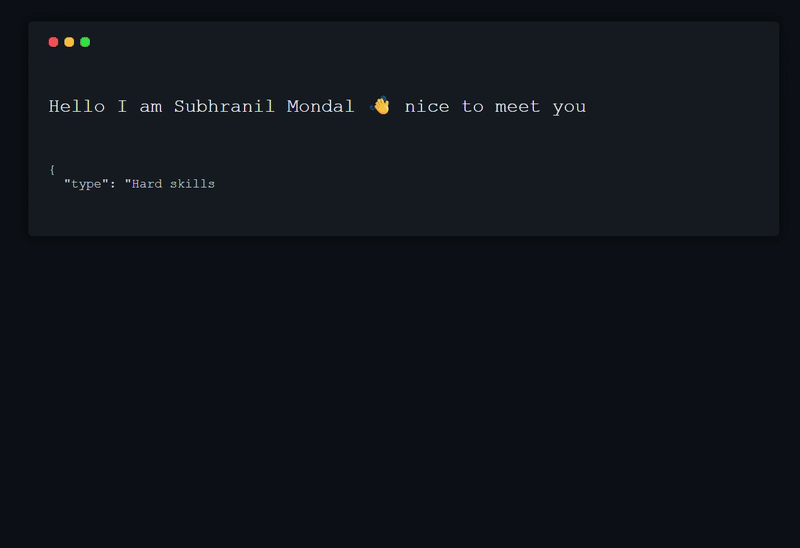

 

  

    

### My mission
I’m driven by a love for solving problems! With a technical background, I’ve always found my place in connecting people and working closely with businesses. My mission is to bridge connections, empower collaboration, and tackle real-world challenges that make a meaningful difference.

### Main skills

### Connect with me!

    

### Employer?
> [!IMPORTANT]  
> <a href="https://drive.google.com/file/d/1EhLLPH-witdCD9CHS2p2nYD9JlS5ZjKu/view" download>Download my resume</a>

😀 Thanks for being my guest

